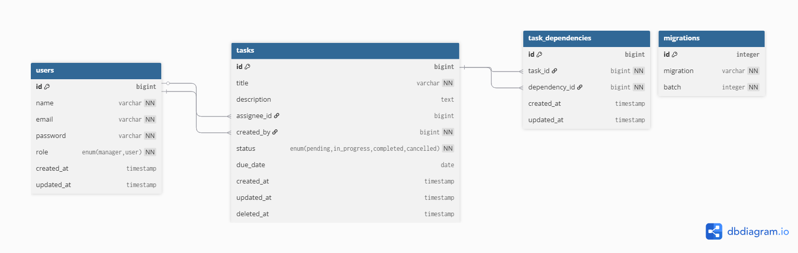

# 📝 Task Manager API

<p align="center">
    <a href="https://laravel.com" target="_blank">
        
    </a>
</p>

A simple **Task Management REST API** built with Laravel.  
Supports authentication, role-based access control, task dependencies, and status validation.

---

## 🚀 Features

- 🔐 Authentication with Laravel Sanctum  
- 🧑‍💼 Role-based permissions (Manager / User)  
- 📝 Task CRUD operations  
- 🧭 Filtering by:
  - status
  - assigned user
  - due date range
- 🧩 Task dependencies (with circular/self dependency checks)
- ⚠️ Validation before marking tasks as completed
- 📬 Postman collection ready for testing

---

## 🧰 Tech Stack

- Laravel 12.x  
- PHP 8.2+  
- Sanctum for API authentication  
- MySQL

---

## ⚡ Installation Guide

```bash
# Clone the repository
git clone https://github.com/Ahmedheshamesmail/task-manager-api.git
cd task-manager-api

# Install dependencies
composer install

# Copy and configure .env
cp .env.example .env
php artisan key:generate

# Migrate and seed
php artisan migrate --seed

# Run the server
php artisan serve

---

## 🔑 Seeded Test Users

| Role     | Email                   | Password   |
|----------|---------------------------|------------|
| Manager  | manager@example.com      | 12345678   |
| User     | user@example.com         | 12345678   |


---

## 📬 API Endpoints

| Method | Endpoint | Description | Role |
|--------|-----------|-------------|-------|
| POST   | `/login`                             | Login and get token                | All |
| POST   | `/logout`                            | Logout                             | Auth |
| GET    | `/tasks`                             | List tasks with filters            | Manager / User |
| GET    | `/tasks/{id}`                        | Show single task                   | Manager / Assignee |
| POST   | `/tasks`                             | Create new task                    | Manager |
| PUT    | `/tasks/{id}`                        | Update task details                | Manager |
| DELETE | `/tasks/{id}`                        | Delete task                        | Manager |
| PATCH  | `/tasks/{id}/status`                 | Update task status                 | Manager / Assignee |
| POST   | `/tasks/{id}/dependencies`           | Add dependency                     | Manager |
| DELETE | `/tasks/{id}/dependencies/{dep_id}`  | Remove dependency                  | Manager |

✅ **Filtering example**:
GET /tasks?status=pending&assignee_id=2&due_date_from=2025-10-10&due_date_to=2025-10-30

---

## 🧭 Authorization Rules

- **Manager**:
  - Create / update / delete any task
  - Assign users
  - Add/remove dependencies
  - Change status of any task
  - List all tasks

- **User**:
  - View assigned tasks only
  - Update status of their own tasks

---

## 🧪 Postman Collection

- 📁 File: `Task Manager API.postman_collection.json`  
- 🌐 Base URL: `http://127.0.0.1:8000/api`  
- 🪄 Login → copy token → set `auth_token` variable → test all endpoints 🚀

---

## 🖼️ ERD Diagram



Users
├─ id, name, email, password, role
│
Tasks
├─ id, title, description, assignee_id, created_by, due_date, status, priority
│
Task_Dependencies
├─ task_id, dependency_id


- One **manager** can create many tasks.  
- One **user** can be assigned to many tasks.  
- A task can depend on multiple tasks.  
- Circular dependencies are not allowed.

---


## 🧑‍💻 Developer

- **Ahmed Hesham Ismail**  
- 🖥️ Backend Developer (Laravel / PHP)  
- 🐙 [GitHub](https://github.com/Ahmedheshamesmail)  
- 📧 Email: (ahmedheshamesmail@gmail.com)

---

